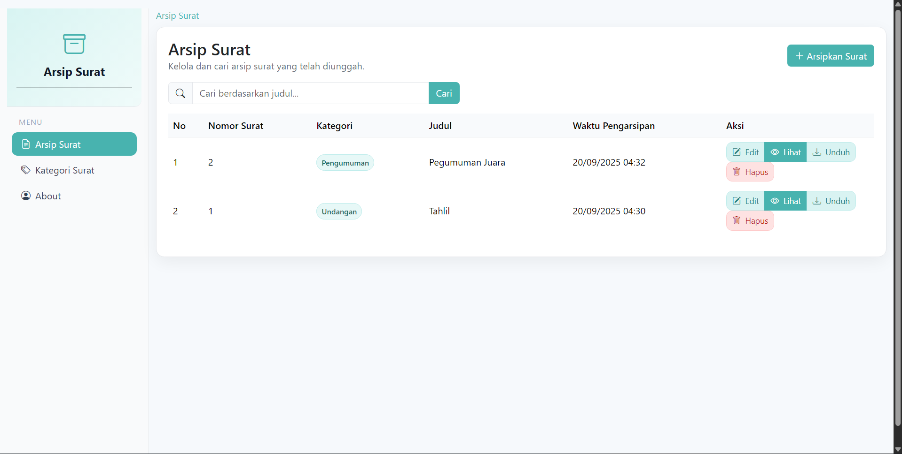
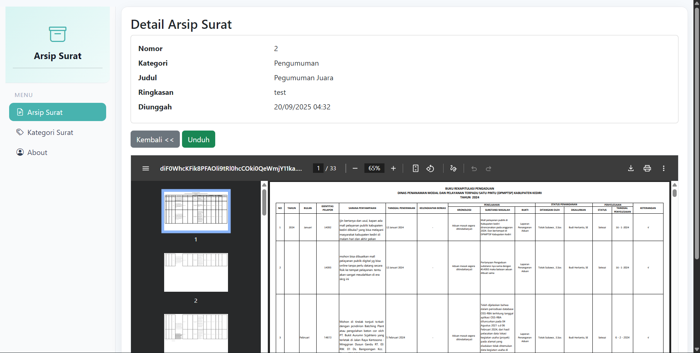
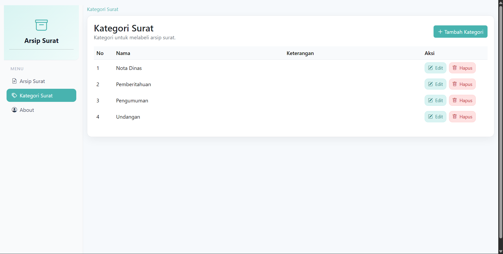
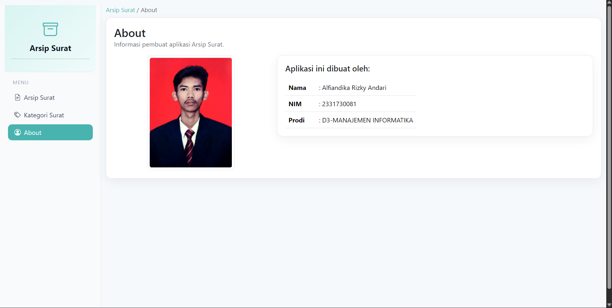

<h1 align="center">Arsip Surat</h1>

Sebuah aplikasi Laravel untuk mengarsipkan surat: unggah PDF, pencarian, kategori surat, pratinjau, unduh, dan pengelolaan data.

Repository: https://github.com/dkarzky/arsipsurat

## Tujuan
Menyediakan sistem pengarsipan surat sederhana untuk menambah, mencari, melihat, mengunduh, dan mengelola kategori surat, dengan antarmuka modern dan mudah digunakan.

## Fitur
- CRUD Arsip Surat (unggah berkas PDF saja)
- Pencarian berdasarkan judul/nomor surat
- Pratinjau PDF langsung di halaman detail
- Unduh berkas PDF
- CRUD Kategori surat (dengan pencegahan hapus jika dipakai)
- Konfirmasi sebelum menghapus
- Halaman About (Nama, NIM, Prodi, Tanggal, Foto)

## Teknologi
- Laravel 11, PHP 8+
- MySQL (Laragon)
- Bootstrap 5 + Bootstrap Icons

## Cara Menjalankan (Windows PowerShell)
1) Buat database MySQL bernama `arsip_surat` (Laragon: http://localhost/phpmyadmin)
2) Salin `.env.example` menjadi `.env` lalu sesuaikan kredensial DB bila perlu:
```
DB_CONNECTION=mysql
DB_HOST=127.0.0.1
DB_PORT=3306
DB_DATABASE=arsip_surat
DB_USERNAME=root
DB_PASSWORD=
```
3) Install dan siapkan aplikasi:
```
composer install
php artisan key:generate
php artisan migrate
php artisan db:seed --class=CategorySeeder
php artisan storage:link
php artisan serve
```
4) Buka http://127.0.0.1:8000

## Impor Database (.sql)
- File ekspor MySQL diharapkan berada di `database/arsip_surat.sql` (buat via phpMyAdmin: Export → SQL)
- Alternatif: jalankan migrasi + seeder (lihat langkah di atas) untuk membuat struktur dan data awal.

## Lokasi Penyimpanan PDF
- File diunggah ke `storage/app/public/arsip`, dapat diakses publik via `/storage/arsip/...`

## Konfigurasi Halaman About
Atur data di `.env`:
```
ABOUT_NAME="Nama Anda"
ABOUT_NIM="NIM Anda"
ABOUT_PRODI="D3-MANAJEMEN INFORMATIKA"
ABOUT_DATE="2025-09-20"
ABOUT_PHOTO="/images/profile.jpg"
```

## Screenshot
Letakkan tangkapan layar di folder `screenshots/` dan referensikan di bawah ini.

1. Dashboard Arsip Surat
	- 
2. Detail Surat (pratinjau PDF)
	- 
3. Kategori Surat
	- 
4. Halaman About
	- 

---

Hak cipta © 2025. Dirancang untuk kebutuhan pembelajaran dan demonstrasi.
